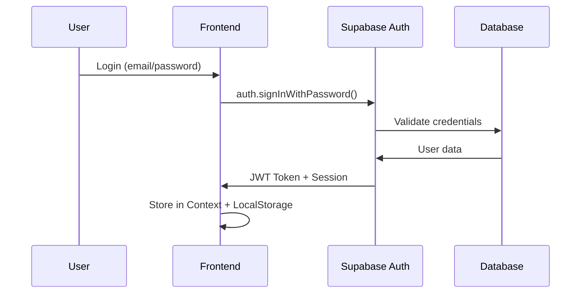
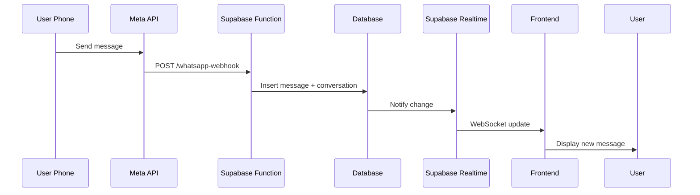
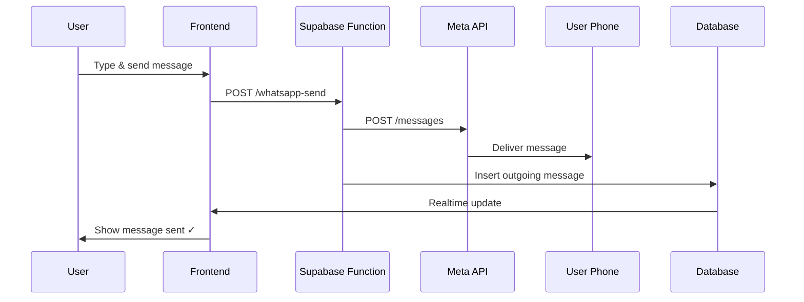
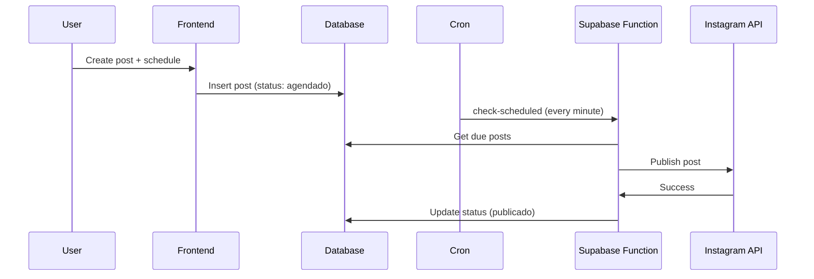

# 🏗️ Arquitetura do SystemLumina

## Visão Geral

SystemLumina é uma plataforma SaaS multi-tenant para gerenciamento de CRM e redes sociais, construída com uma arquitetura moderna e escalável.

```
┌─────────────────────────────────────────────────────────────┐
│                    FRONTEND (React + TypeScript)             │
│  ┌──────────┐  ┌──────────┐  ┌──────────┐  ┌──────────┐   │
│  │   CRM    │  │ Messages │  │  Social  │  │Analytics │   │
│  └──────────┘  └──────────┘  └──────────┘  └──────────┘   │
└─────────────────────────────────────────────────────────────┘
                            ▼ HTTP/WebSocket
┌─────────────────────────────────────────────────────────────┐
│                   SUPABASE (Backend as a Service)            │
│  ┌──────────────────────────────────────────────────────┐  │
│  │              PostgreSQL Database (RLS)                │  │
│  │  ┌────────┐ ┌────────┐ ┌─────┐ ┌──────┐ ┌─────────┐ │  │
│  │  │ Users  │ │ Leads  │ │Conv.│ │Posts │ │Messages │ │  │
│  │  └────────┘ └────────┘ └─────┘ └──────┘ └─────────┘ │  │
│  └──────────────────────────────────────────────────────┘  │
│  ┌──────────────────────────────────────────────────────┐  │
│  │              Edge Functions (Deno Runtime)            │  │
│  │  ┌──────────────┐  ┌──────────────┐  ┌────────────┐ │  │
│  │  │   WhatsApp   │  │  Instagram   │  │  Content   │ │  │
│  │  │   Webhook    │  │     Auth     │  │    Gen     │ │  │
│  │  └──────────────┘  └──────────────┘  └────────────┘ │  │
│  └──────────────────────────────────────────────────────┘  │
│  ┌──────────────────────────────────────────────────────┐  │
│  │                  Realtime Subscriptions               │  │
│  └──────────────────────────────────────────────────────┘  │
└─────────────────────────────────────────────────────────────┘
                            ▼ Webhooks
┌─────────────────────────────────────────────────────────────┐
│                    EXTERNAL APIs                             │
│  ┌──────────────┐  ┌──────────────┐  ┌──────────────┐      │
│  │   WhatsApp   │  │  Instagram   │  │   OpenAI     │      │
│  │ Business API │  │  Graph API   │  │     API      │      │
│  └──────────────┘  └──────────────┘  └──────────────┘      │
└─────────────────────────────────────────────────────────────┘
```

---

## Stack Tecnológica

### Frontend
```typescript
{
  "runtime": "Browser",
  "framework": "React 18.3",
  "language": "TypeScript 5.8",
  "bundler": "Vite 5.4",
  "styling": "TailwindCSS 3.4 + Radix UI",
  "state": "TanStack Query + React Context",
  "routing": "React Router v6",
  "animations": "Framer Motion",
  "icons": "Lucide React"
}
```

### Backend (Supabase)
```typescript
{
  "database": "PostgreSQL 14+",
  "auth": "GoTrue (JWT + OAuth)",
  "storage": "S3-compatible",
  "functions": "Deno Edge Functions",
  "realtime": "WebSockets (Phoenix)",
  "security": "Row Level Security (RLS)"
}
```

### Integrações
```typescript
{
  "messaging": {
    "whatsapp": "Meta WhatsApp Business API v21.0",
    "instagram": "Instagram Graph API v21.0",
    "messenger": "Facebook Messenger API v21.0"
  },
  "ai": {
    "content": "OpenAI GPT-4/GPT-5"
  }
}
```

---

## Estrutura de Diretórios

```
systemlumina/
├── public/                      # Assets estáticos
│   ├── favicon.svg
│   └── placeholder.svg
├── src/                         # Código fonte React
│   ├── components/              # Componentes reutilizáveis
│   │   ├── ui/                  # Componentes base (shadcn/ui)
│   │   ├── crm/                 # Componentes CRM
│   │   ├── AppSidebar.tsx       # Menu lateral
│   │   ├── ChatArea.tsx         # Área de mensagens
│   │   └── ...
│   ├── contexts/                # React Context
│   │   └── AuthContext.tsx      # Contexto de autenticação
│   ├── hooks/                   # Custom hooks
│   │   ├── useLeads.ts
│   │   ├── useNotifications.ts
│   │   └── ...
│   ├── integrations/            # Integrações
│   │   └── supabase/
│   │       ├── client.ts        # Cliente Supabase
│   │       └── types.ts         # Types do DB
│   ├── lib/                     # Utilitários
│   │   ├── utils.ts
│   │   └── mockData.ts
│   ├── pages/                   # Páginas/rotas
│   │   ├── Login.tsx
│   │   ├── CRM.tsx
│   │   ├── Messages.tsx         # 📱 Nova página de mensagens
│   │   ├── WhatsAppConfig.tsx   # 📱 Nova configuração WhatsApp
│   │   ├── InstagramConfig.tsx
│   │   └── ...
│   ├── App.tsx                  # Componente raiz
│   ├── main.tsx                 # Entry point
│   └── index.css                # Estilos globais
├── supabase/                    # Configuração Supabase
│   ├── functions/               # Edge Functions
│   │   ├── whatsapp-webhook/    # 📱 Nova: Webhook WhatsApp
│   │   ├── whatsapp-send/       # 📱 Nova: Enviar mensagem WhatsApp
│   │   ├── instagram-auth/
│   │   ├── generate-content/
│   │   └── ...
│   └── migrations/              # Migrations SQL
│       ├── 20260321000000_systemlumina_merge.sql
│       └── 20260412000000_add_messaging_system.sql  # 📱 Nova
├── .env.example                 # Template de variáveis
├── package.json
├── vite.config.ts
├── tailwind.config.ts
├── README.md                    # ✅ Atualizado
├── SETUP_GUIDE.md              # 📱 Novo guia de configuração
└── ARCHITECTURE.md             # 📱 Este arquivo
```

---

## Fluxo de Dados

### 1. Autenticação


### 2. Mensagens WhatsApp (Recebimento)


### 3. Mensagens WhatsApp (Envio)


### 4. Posts Instagram


---

## Banco de Dados (Schema)

### ERD Simplificado

```
┌─────────────┐      ┌─────────────────┐      ┌──────────────┐
│    users    │──┐   │  conversations  │──────│   messages   │
│  (auth)     │  │   │                 │      │              │
└─────────────┘  │   │ - contact_name  │      │ - content    │
                 │   │ - channel       │      │ - direction  │
                 │   │ - status        │      │ - created_at │
                 │   └─────────────────┘      └──────────────┘
                 │
                 ├───┌─────────────────┐
                 │   │      leads      │
                 │   │                 │
                 │   │ - name          │
                 │   │ - email         │
                 │   │ - stage         │
                 │   │ - value         │
                 │   └─────────────────┘
                 │
                 ├───┌──────────────────────┐
                 │   │  whatsapp_connections│
                 │   │                      │
                 │   │ - phone_number_id    │
                 │   │ - access_token       │
                 │   │ - is_active          │
                 │   └──────────────────────┘
                 │
                 ├───┌──────────────────────┐
                 │   │ instagram_connections│
                 │   │                      │
                 │   │ - instagram_user_id  │
                 │   │ - access_token       │
                 │   │ - page_id            │
                 │   └──────────────────────┘
                 │
                 └───┌─────────────┐
                     │    posts    │
                     │             │
                     │ - content   │
                     │ - platform  │
                     │ - status    │
                     │ - scheduled │
                     └─────────────┘
```

### Principais Relacionamentos

- `users` (1) ↔ (N) `conversations`
- `users` (1) ↔ (N) `leads`
- `users` (1) ↔ (N) `posts`
- `users` (1) ↔ (1) `whatsapp_connections`
- `users` (1) ↔ (1) `instagram_connections`
- `conversations` (1) ↔ (N) `messages`

---

## Segurança

### Row Level Security (RLS)

Todas as tabelas implementam RLS para garantir isolamento multi-tenant:

```sql
-- Exemplo: Política para tabela conversations
CREATE POLICY "Users can only view own conversations"
  ON conversations FOR SELECT
  USING (auth.uid() = user_id);

CREATE POLICY "Users can only insert own conversations"
  ON conversations FOR INSERT
  WITH CHECK (auth.uid() = user_id);
```

### Autenticação
- JWT tokens com expiração configurável
- Refresh tokens automático
- OAuth 2.0 para integrações Meta

### API Keys
- Armazenadas como secrets no Supabase
- Nunca expostas no frontend
- Rotação recomendada a cada 90 dias

---

## Performance

### Frontend
- **Code splitting**: Lazy loading de rotas
- **Caching**: TanStack Query com 5min stale time
- **Otimistic updates**: UI atualiza antes da confirmação
- **Virtualization**: Listas longas com `react-window`

### Backend
- **Indexes**: Criados em colunas frequentemente consultadas
- **Polling**: Realtime subscriptions em vez de polling constante
- **Edge Functions**: Deploy em CDN global (baixa latência)

### Database
- **Connection pooling**: PgBouncer automático
- **Índices compostos**: Para queries complexas
- **Particionamento**: Para tabelas com muitos registros

---

## Escalabilidade

### Limites Atuais (Free Tier)

| Recurso | Limite Free | Limite Pro |
|---------|-------------|------------|
| Database Storage | 500 MB | 8 GB |
| Bandwidth | 2 GB/mês | 50 GB/mês |
| Edge Functions | 500K invocações | 2M invocações |
| Auth Users | Ilimitado | Ilimitado |
| Realtime Connections | 200 | 500 |

### Estratégias de Escala

1. **Horizontal**: Adicionar mais Edge Functions (auto-scale)
2. **Vertical**: Upgrade do plano Supabase
3. **Caching**: Redis/Upstash para dados frequentes
4. **CDN**: Vercel Edge para assets estáticos
5. **Read Replicas**: Para analytics pesados

---

## Monitoramento

### Métricas Chave

- **Uptime**: Meta > 99.9%
- **Latência API**: Meta < 200ms (p95)
- **Error Rate**: Meta < 0.1%
- **Webhook Delivery**: Meta > 99%

### Ferramentas

- **Supabase Dashboard**: Logs e métricas
- **Vercel Analytics**: Performance frontend
- **Meta Business Manager**: Status de APIs
- **Sentry** (opcional): Error tracking

---

## Deploy

### Pipeline CI/CD

```yaml
# GitHub Actions (exemplo)
main branch push → Run tests → Build → Deploy to Vercel
                                    ↓
                          Deploy Edge Functions to Supabase
```

### Ambientes

- **Development**: `localhost:5173` + Supabase local
- **Staging**: `staging.systemlumina.com` + Supabase staging
- **Production**: `systemlumina.com` + Supabase prod

---

## Roadmap Técnico

### Q2 2026
- [ ] GraphQL API (substituir REST)
- [ ] WebSocket nativo (sem polling)
- [ ] Rate limiting por tenant
- [ ] Backup automático diário

### Q3 2026
- [ ] App Mobile (React Native)
- [ ] Elasticsearch para busca avançada
- [ ] Redis cache layer
- [ ] Multi-region deployment

### Q4 2026
- [ ] AI agents com fine-tuning
- [ ] Voice messages suporte
- [ ] Video conferência integrada
- [ ] Marketplace de plugins

---

## Contribuindo

### Padrões de Código

- **TypeScript strict mode**: Sempre
- **ESLint + Prettier**: Auto-format on save
- **Conventional Commits**: `feat:`, `fix:`, `docs:`, etc.
- **Tests**: Vitest + Testing Library (cobertura > 80%)

### Fluxo de Desenvolvimento

1. Create feature branch: `git checkout -b feature/new-feature`
2. Code + commit: `git commit -m "feat: add new feature"`
3. Push: `git push origin feature/new-feature`
4. Open PR → Review → Merge to main
5. Auto-deploy to production

---

## Licença

MIT License - Veja [LICENSE](LICENSE) para detalhes.

---

<div align="center">
  <p><strong>SystemLumina</strong> - Arquitetura moderna para o futuro do CRM</p>
  <p>Última atualização: Abril 2026</p>
</div>
